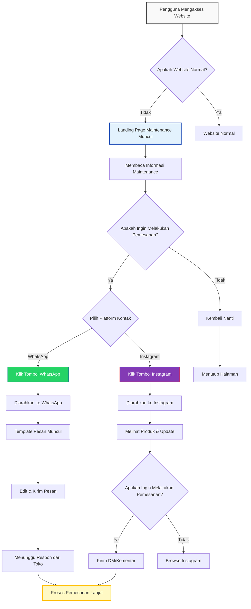

# User Flow Diagram - Landing Page Maintenance TOSERBA WS PEDAK

## User Journey Map



## Detailed User Flow Steps

### 1. Entry Point
- **Trigger**: Pengguna mengakses website TOSERBA WS PEDAK
- **Expectation**: Melihat website normal dengan produk dan layanan
- **Actual Experience**: Landing page maintenance muncul

### 2. First Impression (0-5 seconds)
- **Visual**: Logo TOSERBA WS PEDAK terlihat jelas
- **Message**: "Sedang Dalam Perbaikan" terbaca dengan jelas
- **Initial Reaction**: Confusion atau understanding tergantung pada kejelasan pesan

### 3. Information Processing (5-15 seconds)
- **Action**: Membaca penjelasan tentang maintenance
- **Key Information**:
  - Website sedang diperbarui
  - Estimasi waktu 1-2 hari
  - Alasan maintenance (perbaikan sistem pemesanan)
  - Alternatif cara pemesanan

### 4. Decision Point (15-30 seconds)
- **Primary Decision**: Apakah perlu melakukan pemesanan sekarang?
- **Secondary Decision**: Platform mana yang akan digunakan?

#### Path A: Need to Order Now
1. **Scan CTA Options**: Melihat tombol WhatsApp dan Instagram
2. **Platform Selection**: Berdasarkan preferensi pengguna
   - WhatsApp: Untuk komunikasi langsung dan cepat
   - Instagram: Untuk melihat produk terlebih dahulu

#### Path B: No Immediate Need
1. **Acknowledge Information**: Memahami situasi maintenance
2. **Exit Decision**: Kembali lain kali atau bookmark halaman

### 5. WhatsApp Flow (Primary Path)
1. **Click WhatsApp Button**
   - Visual feedback: Button animasi dan hover effect
   - URL redirect ke WhatsApp Web/Mobile App

2. **WhatsApp Interface**
   - Template pesan muncul:
     ```
     Halo Toserba WS Pedak, saya ingin melakukan pemesanan produk. Mohon informasikan cara pemesanan selama website maintenance.
     ```
   - Nomor tujuan: +6281239602221

3. **Message Customization**
   - Pengguna dapat edit template pesan
   - Menambahkan detail pesanan spesifik

4. **Send Message**
   - Tunggu respon dari toko
   - Lanjut proses pemesanan via WhatsApp

### 6. Instagram Flow (Secondary Path)
1. **Click Instagram Button**
   - Visual feedback: Button animasi dan hover effect
   - URL redirect ke Instagram profile @toserbawspedak

2. **Instagram Interface**
   - Melihat feed dengan produk-produk
   - Melihat highlights dengan informasi penting
   - Browse produk yang tersedia

3. **Engagement Options**
   - DM untuk pemesanan langsung
   - Komentar di post produk
   - Menggunakan contact di bio

4. **Order Process**
   - Kirim DM dengan detail pesanan
   - Tunggu respon dari admin
   - Lanjut proses pemesanan via Instagram

## User Pain Points & Solutions

### Pain Point 1: Confusion About Website Status
- **Problem**: Pengguna tidak tahu apakah website error atau maintenance
- **Solution**: 
  - Judul yang jelas "Sedang Dalam Perbaikan"
  - Penjelasan singkat tentang apa yang terjadi
  - Estimasi waktu yang realistis

### Pain Point 2: Difficulty Finding Contact Information
- **Problem**: Kontak tidak mudah ditemukan atau diakses
- **Solution**:
  - Tombol CTA yang besar dan jelas di atas fold
  - Direct link ke WhatsApp dan Instagram
  - Nomor telepon yang bisa di-klik

### Pain Point 3: Uncertainty About Ordering Process
- **Problem**: Tidak tahu cara memesan selama maintenance
- **Solution**:
  - Template pesan WhatsApp yang siap digunakan
  - Instruksi jelas di landing page
  - Multiple contact options

### Pain Point 4: Loss of Trust Due to Website Downtime
- **Problem**: Pengguna kehilangan kepercayaan pada toko
- **Solution**:
  - Design profesional dan konsisten dengan branding
  - Informasi yang transparan tentang maintenance
  - Alternatif yang mudah untuk tetap berbelanja

## Success Metrics

### Primary Metrics
- **Click-Through Rate (CTR)** pada tombol WhatsApp dan Instagram
- **Time on Page**: Berapa lama pengguna stay di landing page
- **Bounce Rate**: Persentase pengguna yang langsung meninggalkan halaman

### Secondary Metrics
- **Conversion Rate**: Persentase pengguna yang menghubungi toko
- **Platform Preference**: Rasio pengguna WhatsApp vs Instagram
- **Return Visits**: Persentase pengguna yang kembali setelah maintenance

## Optimization Opportunities

### A/B Testing Ideas
1. **CTA Button Text**: 
   - "Pesan via WhatsApp" vs "Hubungi Kami"
   - Dengan/without icon

2. **Message Copy**:
   - Formal vs informal tone
   - Panjang penjelasan maintenance

3. **Visual Elements**:
   - Dengan/without illustration
   - Photo vs graphic elements

### Continuous Improvement
1. **User Feedback Collection**
   - Survey singkat tentang pengalaman
   - Feedback form di landing page

2. **Analytics Monitoring**
   - Heatmap untuk melihat perilaku pengguna
   - Session recording untuk identifikasi pain points

3. **Regular Updates**
   - Update informasi maintenance secara berkala
   - Countdown timer jika maintenance berlangsung lebih lama

## Mobile vs Desktop Considerations

### Mobile Optimization
- **Thumb-Friendly Design**: Tombol CTA di area mudah dijangkau
- **One-Handed Operation**: Semua elemen interaktif di bawah fold
- **Fast Loading**: Minimal elements untuk quick load time

### Desktop Optimization
- **Larger Visual Elements**: Lebih banyak space untuk illustrations
- **Multi-Tasking**: Informasi lebih detail bisa ditampilkan
- **Keyboard Navigation**: Support untuk tab navigation

## Post-Maintenance Strategy

### Transition Plan
1. **Announcement**: Banner pengumuman website kembali normal
2. **Special Offer**: Diskon atau promo untuk pelanggan yang terdampak
3. **Feedback Request**: Survey tentang pengalaman maintenance

### Retention Strategy
1. **Email Notification**: Notify users when website is back online
2. **Social Media Update**: Post di Instagram tentang website normal
3. **Thank You Message**: Appreciation message untuk kesabaran pelanggan